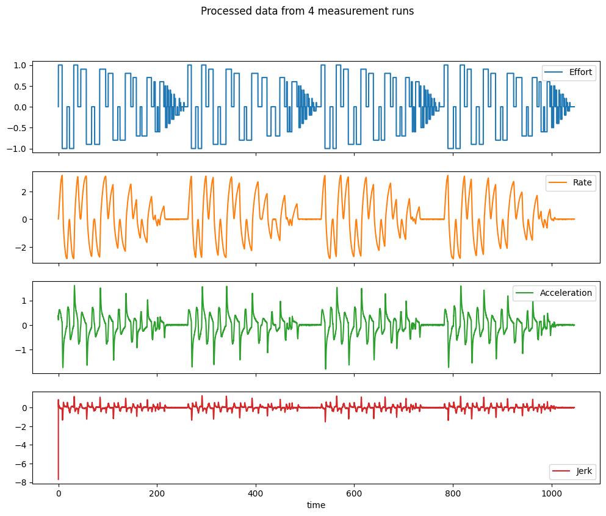
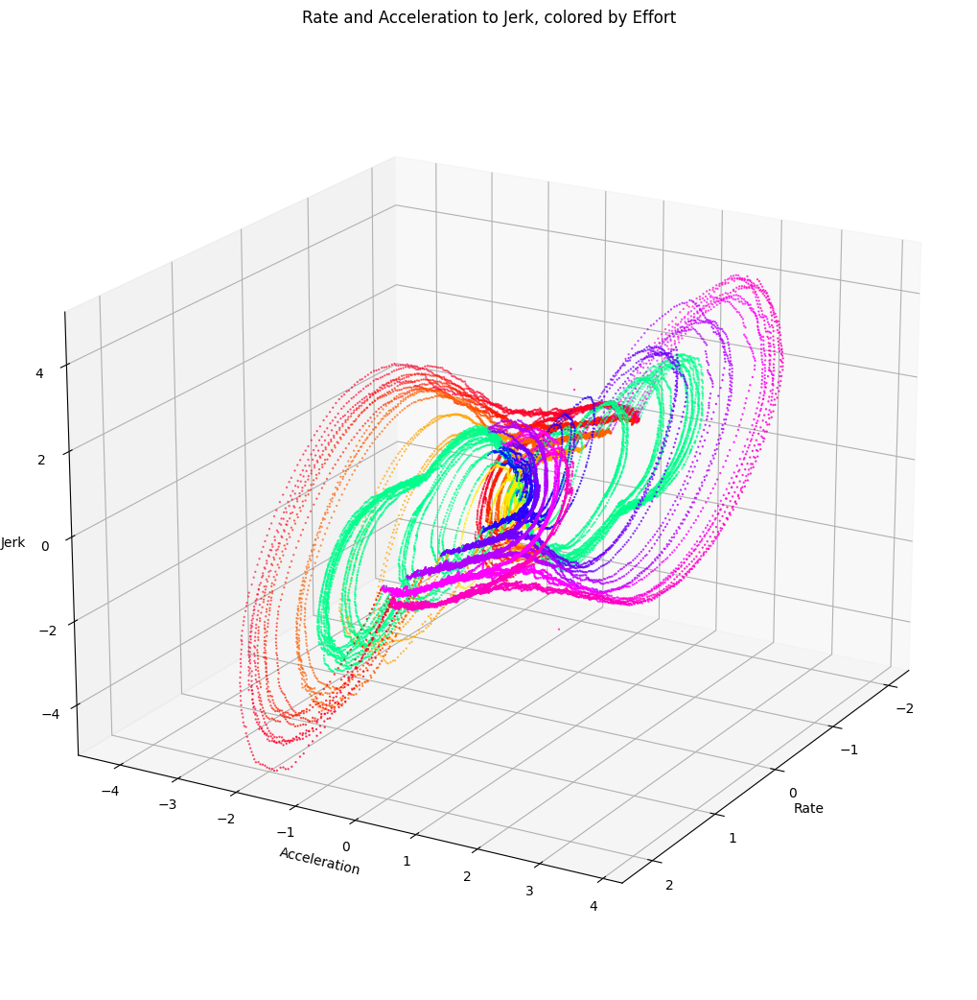

# Machine learning for dynamics modeling

We developed a machine learning model that predicts the dynamics of a motor given the current state. Using a dataset of motor dynamics measurements, the model is used to predict the dynamics of the system in a closed-loop control system.

## 1. Data Collection and processing

To create the dataset, we ran a series of measurements using a dynamometer and the motor firmware. The resulting data is a rate time series for each effort value.

Then, we derived acceleration and jerk. The following plots show the resulting data:

 The resulting dataset maps the following input vector to a jerk value, that can later be integrated to state of the system in time ∆t from the previous state:

$\begin{bmatrix}
Effort_t\\
Rate_t\\
Acceleration_t\\
\end{bmatrix} \rightarrow Jerk_t \rightarrow 
\begin{bmatrix}
Effort_{t+1}\\
Rate_{t+1}\\
Acceleration_{t+1}\\
\end{bmatrix}$

The following plot shows the 3D relation between the input vector and the output jerk:

